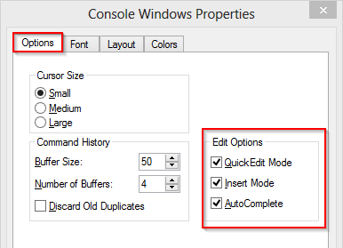
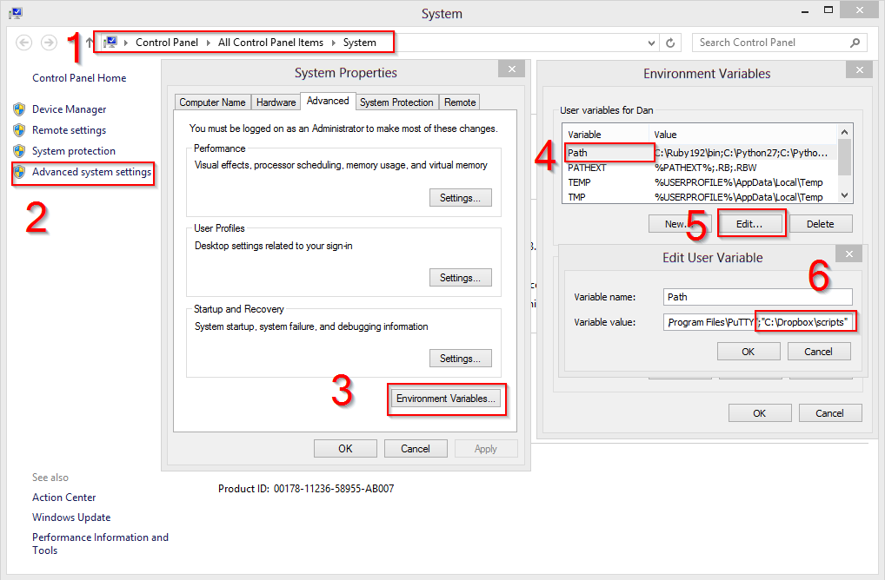
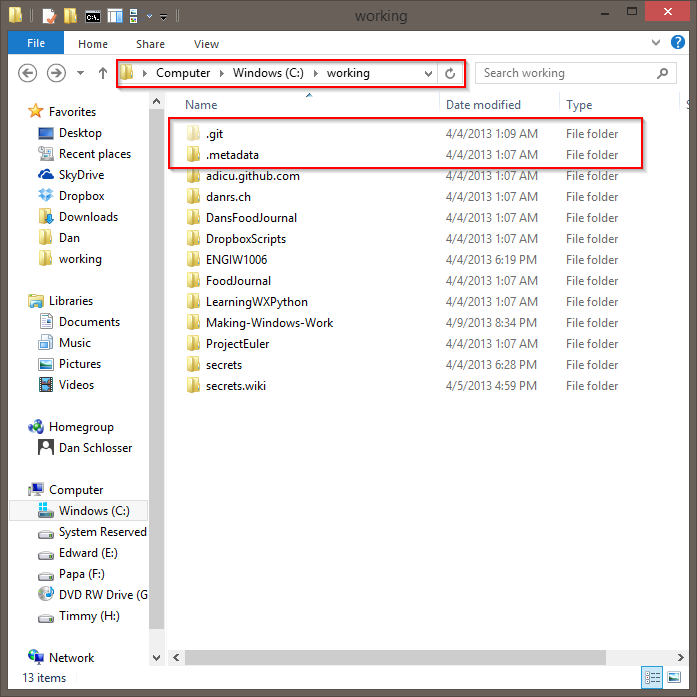

# Coding on Windows: A tutorial
*Us Windows people get a hard time.  Let's make some of the hard stuff easier.*

## Good Practices: Installing Languages

- Download an executable from the official website for the language.
- Do your very best to only only install one version of a given language at a time on your computer.  This saves a lot of heartache.
- Be consistent about where you install them.  Choose a directory close to the root and without spaces.  Choose either:
  - `C:\dev\Python27`, `C:\dev\Ruby191`, etc. OR
  - `C:\Python27`, `C:\Ruby191`, etc.
- **Run the installer yourself**
- Verify installation success in CMD (be sure the executable is [in your PATH](#path)).
- Integrate with Eclipse or any other development environment using plugins for that development environment.

### Installing Git

Please.  *Please*. ***Please***. Do [this entire tutorial](https://help.github.com/articles/set-up-git). And don't skip any steps. It's really good.  The `Password caching` section is a great tip too.

### Installing Python

Unless you really know better, install Python 2.7.5 proper MSI installer from [the `Downloads` section of `python.org`](http://www.python.org/download/releases/2.7.5/).  Please note that Python 2.7.5 is **not** the latest version of Python (that version is not as well supported / used as Python 2.7.*).

## CMD Tips:

1. Open `cmd.exe` from the Start Menu.
2. Press `Alt + Space + D` to open the default settings.
3. Under the "Options" tab, check all three boxes in the "Edit Options" section.
4. Restart CMD.
5. Click and drag to select, `Enter` to copy, and right click to paste.

[](./images/CMD_Tips_1.png)

### Beautify CMD

1. In the same window, switch to the "Colors" tab.
2. Edit "Screen Background" and "Screen Text".
3. Restart CMD

[](./images/CMD_Tips_2.png)

## CMD Tips: Adding to Your PATH

### Through the GUI

1. Navigate to `Control Panel\All Control Panel Items\System`
2. Click "Advanced system settings" on the left panel
3. Click "Environment Variables..."
4. Select the "Path" row in the "User variables for %YourName%" box.
5. Click "Edit..."
6. Change the "Variable value" to look like this:
```
"C:\OtherPaths\";"C:\MorePaths\";"C:\Full Path\To\scripts"
``` 
7. Click OK 3 times.

[](./images/CMD_Tips_4.png)

### Using CMD
1. To view your `PATH` type `echo %PATH%`
2. To set your `PATH` type `SET PATH=%PATH%;"C:\Full Path\To\scripts"`

## Good Practices: Keeep a Working Directory

- A directory for all of your coding projects
- Should be located at `C:\working\` for easy access. You can get there in CMD by typing `cd/working` from **anywhere**.
- This should be your Eclipse workspace, and the place where you called `git init`.

[](./images/Keep_a_Working_Directory.png)

## Helpful Applications for Programmers

- [7-Zip](http://7-zip.org/) - Unpackage any package, period.
- [Dropbox](https://www.dropbox.com/) - File syncronization across multiple computers for free.
- [Eclipse](http://www.eclipse.org/) - Full featured, heavy-duty IDE.
- [Git](http://git-scm.com/) - Version control system used by the likes of Linux and Android.
- [Google Chrome](http://www.google.com/chrome/) and [Firefox](http://www.mozilla.org/en-US/firefox/new/) - Use one as your main browser, and another as a fallback.  I pity the fool who falls back onto [IE](http://windows.microsoft.com/en-us/internet-explorer/download-ie).
- [Greenshot](http://getgreenshot.org/) - Simple tools for professional looking screenshots.
- [MarkdownPad](http://markdownpad.com/) - For editing markdown documents like this slideshow and GitHub READMEs.
- [Microsoft Security Essentials](http://windows.microsoft.com/en-us/windows/security-essentials-download) or [Avast Antivirus](http://www.avast.com/index?ClickID=dozhctrtms0cr0hrrbhsb0cbssybmc2s2roy) - Antivirus software
- [Notepad++](http://notepad-plus-plus.org/) - Lightweight, versitile, and free text editor for programmers.  Some people use [SublimeText](http://www.sublimetext.com/), which is slightly less feature rich, but much more beautiful.